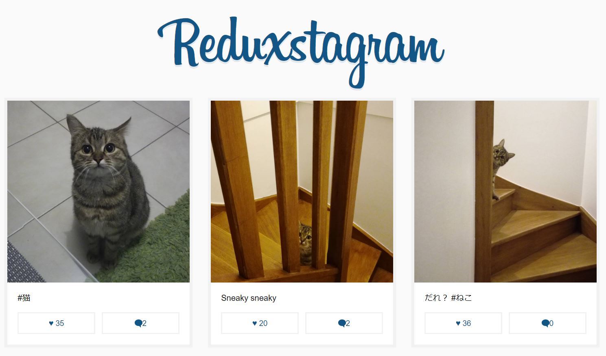

# Reduxstagram

A simple React + Redux Instagram clone with static data.

Features include Liking and Commenting (add, delete)

## Running

First `npm install` to grab all the necessary dependencies. 

Then run `npm start` and open <localhost:7770> in your browser.

## Production Build

Run `npm build` to create a distro folder and a bundle.js file.
